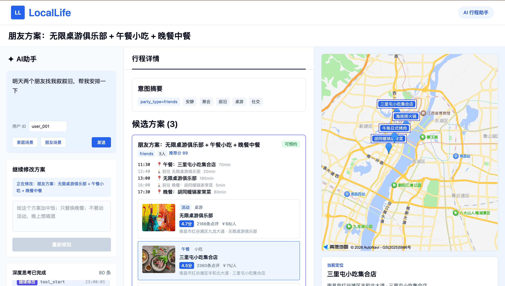
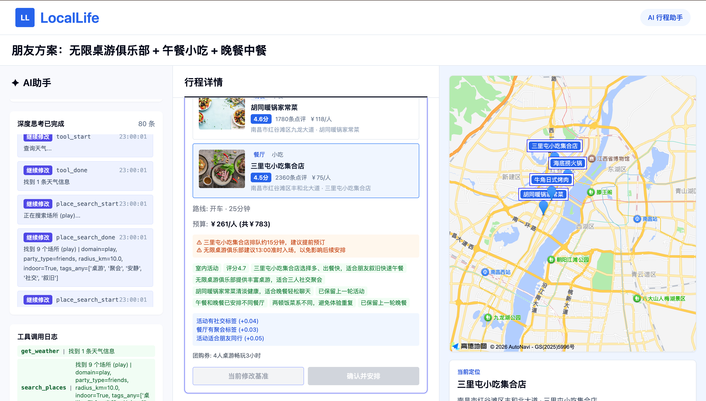
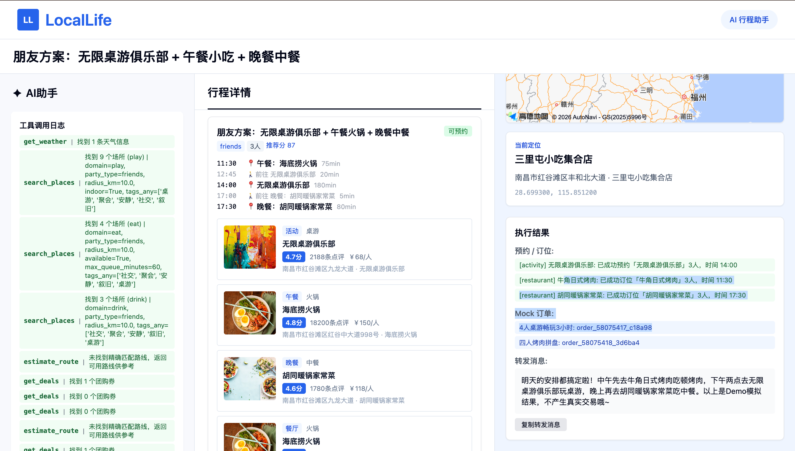
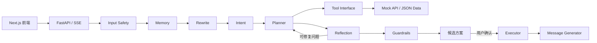

# LocalLife Agent

<p align="center">
  <strong>面向周末闲时场景的本地活动规划与执行 Agent</strong>
</p>

<p align="center">
  用一句自然语言描述时间、同行人和偏好，系统自动完成意图理解、场所召回、行程组合、地图联动、方案反思，并在用户确认后执行 Mock 预约与下单。
</p>

<p align="center">
  
  
  
  
  
</p>

<p align="center">
  
</p>

## 项目简介

LocalLife Agent 是一个可运行的本地生活 Agent Demo，面向“周末下午有空，帮我安排一下”这类开放式需求。它不只返回搜索结果，而是把活动、餐厅、饮品、配送、路线、天气和团购券组合成有时间线、预算、风险提示和执行动作的完整方案。

项目采用 **Planning + Tool Use + Reflection + Human-in-the-loop Execution**：

1. 理解同行人、人数、时间、地点、预算和偏好。
2. 将自然语言对齐到 `play`、`eat`、`drink`、`delivery` 四个业务领域。
3. 从 Mock API 召回真实存在于本地数据集的候选。
4. 使用 DeepSeek 组合方案，并通过本地规则校验 ID、时间线和 actions。
5. Reflection 与 Guardrails 检查需求覆盖、可执行性和安全边界。
6. 用户确认后才执行 Mock 预约、订位、团购券订单或配送订单。

## 产品亮点

| 能力 | 说明 |
| --- | --- |
| 自然语言规划 | 支持家庭、朋友、情侣、长辈、聚会、吃饭、饮品、外卖闪送等本地生活场景。 |
| 多轮修改 | 支持“保留活动，只换晚餐”“再带上我老婆”“下午桌游，晚饭后喝酒”等增删改要求。 |
| 语义一致性 | 统一处理保留、替换、新增、删除、锁定槽位和人数覆盖，避免针对单个商品或活动写死规则。 |
| 地图联动 | 候选 POI 与高德地图标记联动，点击卡片可定位具体场所。 |
| 可解释推荐 | 展示意图摘要、人数、推荐分、时间线、预算、团购券、推荐理由和风险提示。 |
| 可观察 Agent | SSE 实时展示输入安全、意图解析、标签对齐、工具调用、方案组合、反思和风控过程。 |
| 反思重试 | 明确需求缺失、隐藏 action 或顺序不合理时，可返回 Planner 重新生成一次。 |
| 确认后执行 | 规划阶段只读；用户点击“确认并安排”后才执行 Mock 预约和订单。 |
| LLM 降级 | DeepSeek 不可用或 JSON 不合法时，使用规则与本地组合器兜底。 |

## 产品截图

### 候选方案与地图联动

<p align="center">
  
</p>

### 方案细节与工具日志

<p align="center">
  
</p>

### 确认执行与转发消息

<p align="center">
  
</p>

## Agent 架构



### 规划链路

```text
输入安全
→ 读取记忆与上下文改写
→ 意图解析
→ 标签对齐
→ 天气 / 场所 / 配送商品召回
→ LLM 方案组合
→ 本地 JSON、ID、槽位和 action 校验
→ 路线 / 团购券补全
→ 评分
→ Reflection
→ Guardrails
→ SSE 返回候选方案
```

### 确认链路

```text
用户选择 plan_id
→ 活动 / 餐厅 / 饮品 Mock 预约
→ 团购券 / 配送 Mock 订单
→ 生成转发消息
→ 消息 Guardrails
→ 写回 Session
```

更完整的节点职责、工具调用和异常处理说明见 [设计文档](docs/design.md)。

## 技术栈

| 层面 | 技术 |
| --- | --- |
| 前端 | Next.js 14、React 18、TypeScript、Tailwind CSS |
| 地图 | 高德地图 Web 端 JavaScript API 2.0 |
| 后端 | FastAPI、Pydantic、Uvicorn |
| Agent | LangGraph、DeepSeek API、规则兜底 |
| 通信 | REST API、Server-Sent Events |
| 数据 | 本地 JSON Mock Data |
| 测试 | Pytest、Next.js Build |

## 快速开始

### 1. 克隆项目

```bash
git clone https://github.com/rs8bits/LocalLifeAgent.git
cd LocalLifeAgent
```

### 2. 配置并启动后端

macOS / Linux：

```bash
bash scripts/setup_backend.sh
cp .env.example .env
```

编辑 `.env`：

```bash
DEEPSEEK_API_KEY=your_deepseek_api_key
DEEPSEEK_BASE_URL=https://api.deepseek.com
DEEPSEEK_MODEL=deepseek-v4-flash
DEEPSEEK_TIMEOUT_SECONDS=90
DEEPSEEK_MAX_RETRIES=2
DEEPSEEK_RETRY_BACKOFF_SECONDS=0.8
```

启动后端：

```bash
bash scripts/run_backend.sh
```

Windows PowerShell：

```powershell
.\scripts\run_backend_win.ps1
```

后端地址：

- API：`http://127.0.0.1:8000`
- 健康检查：`http://127.0.0.1:8000/health`
- Swagger：`http://127.0.0.1:8000/docs`

> DeepSeek Key 是可选项。未配置时系统仍可使用规则引擎和本地方案组合器运行。

### 3. 配置并启动前端

```bash
cd frontend
npm install
cp .env.local.example .env.local
```

编辑 `frontend/.env.local`：

```bash
NEXT_PUBLIC_AMAP_JS_KEY=your_amap_js_api_key
NEXT_PUBLIC_AMAP_SECURITY_CODE=your_amap_security_js_code
```

这里需要高德控制台中服务平台为 **Web端（JS API）** 的 Key，以及对应的安全密钥。未配置时页面会显示本地坐标预览。

启动前端：

```bash
npm run dev
```

打开 `http://127.0.0.1:3000`。

## 推荐体验输入

```text
周末下午空的，帮我安排一下
明天两个朋友找我叙叙旧，想安静一点
下午玩桌游，吃完晚饭后想喝点酒，我们有四个人
带老婆和 5 岁孩子出去玩，别太远，晚餐清淡一点
给国博的朋友送几杯奶茶过去
```

生成方案后，可以继续输入：

```text
带上我老婆一起去
活动保留，只替换晚餐
不要配送，饭后加一家精酿酒吧
我们改成四个人
```

## API

| 方法 | 路径 | 说明 |
| --- | --- | --- |
| `POST` | `/api/agent/plan` | 生成候选方案，不执行预约和下单 |
| `POST` | `/api/agent/plan/stream` | 通过 SSE 返回规划过程和候选方案 |
| `POST` | `/api/agent/confirm` | 确认并执行 Mock 预约 / 订单 |
| `POST` | `/api/agent/confirm/stream` | 通过 SSE 返回确认执行过程 |
| `GET` | `/api/agent/session/{session_id}` | 查询 Session |
| `GET` | `/health` | 健康检查与 LLM 配置状态 |

Mock API 覆盖活动、餐厅、饮品、配送、路线、天气、团购券、预约和订单，完整接口可在启动后查看 Swagger。

## 项目结构

```text
LocalLifeAgent/
├── backend/
│   ├── agent/           # LangGraph、Intent、Planner、Reflection、Guardrails
│   ├── tools/           # Tool Interface 与 Mock 工具
│   ├── mock_api/        # 本地生活 Mock API
│   ├── data/            # 活动、餐厅、饮品、路线、团购券等 JSON
│   └── tests/           # 后端测试
├── frontend/
│   ├── app/             # Next.js 页面
│   ├── components/      # 方案卡片、高德地图等组件
│   ├── lib/             # API 与 SSE 客户端
│   └── types/           # TypeScript 类型
├── docs/
│   ├── design.md        # Agent 设计文档
│   └── images/          # README 产品截图
└── scripts/             # 前后端环境与启动脚本
```

## 测试

后端：

```bash
.venv/bin/pytest backend/tests -q
```

前端：

```bash
cd frontend
npm run build
```

当前测试覆盖输入安全、意图解析、标签对齐、工具、规划、LLM 兜底、多轮修改、Reflection、Guardrails、SSE 和确认执行。

## 安全与边界

- `.env` 与 `frontend/.env.local` 已加入 `.gitignore`，禁止提交真实 DeepSeek 或高德 API Key。
- `.env.example` 与 `frontend/.env.local.example` 仅保留占位值。
- 所有活动、餐厅、价格、库存、团购券、预约和订单均为 Mock Data。
- 规划阶段禁止写入预约或订单；确认阶段才允许执行。
- LLM 不能作为业务事实来源，所有 POI、商品和 action ID 都要经过本地校验。
- 本项目不进行真实支付，不代表真实库存或预约结果。

## 文档

- [产品与技术范围](PROJECT.md)
- [开发计划与交付状态](PLAN.md)
- [Agent 设计文档](docs/design.md)
- [开发执行约束](AGENT.md)

## License

本项目用于学习、演示与黑客松场景。地图数据及底图版权归高德地图所有。
